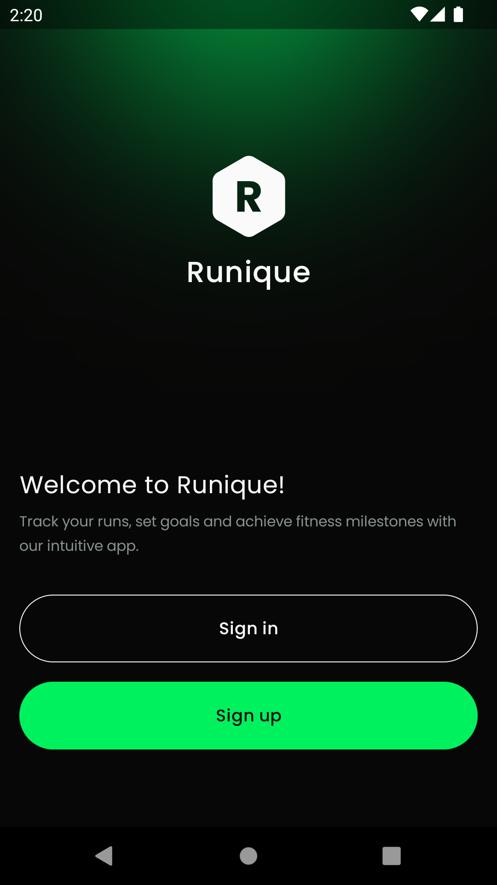
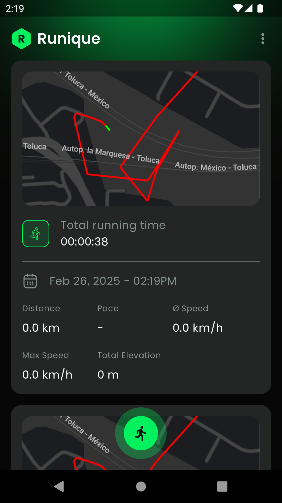
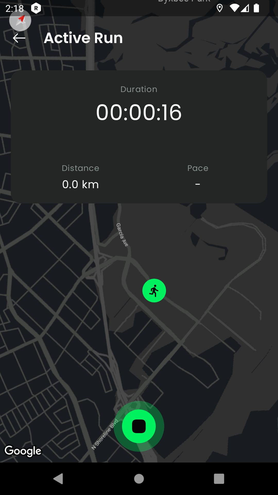
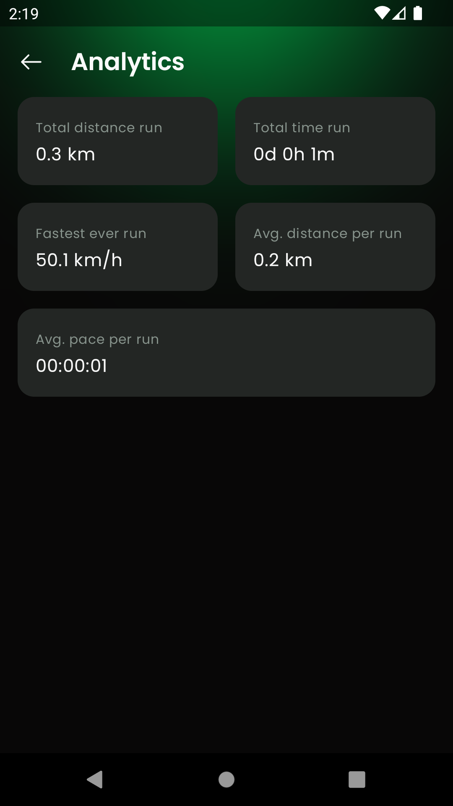
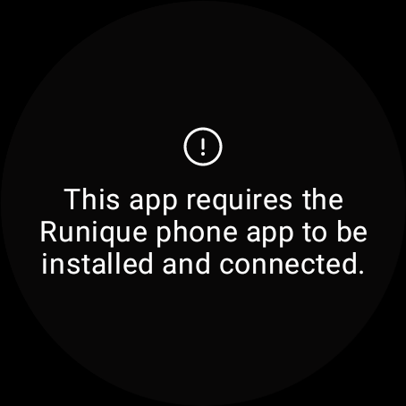
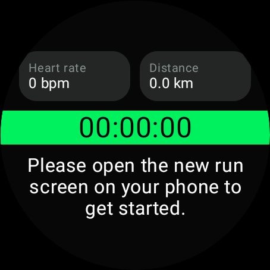
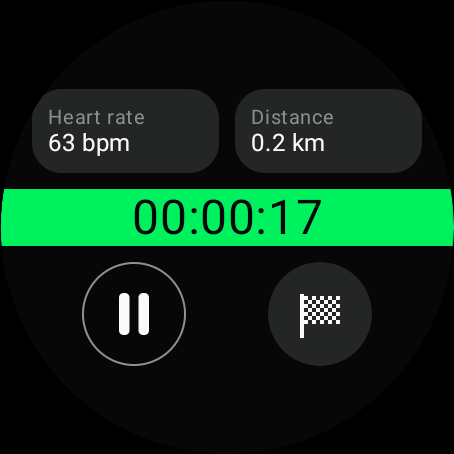
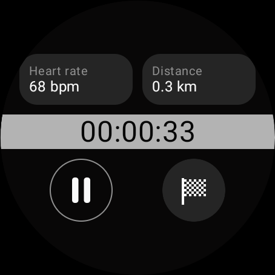

# 📱 Runique 

Runique is an app designed for runners who want to keep an accurate record of their routes and running statistics. 
With a modern and intuitive interface, you can monitor your runs in real-time and review your training history.

Also you can sync with you watch and sync with runique mobile app.⌚️

## ✨ Features app
✅ Real time tracking 
✅ Offline mode
✅ Detail analytics

## ✨ Features wear app
✅ Sync with runique app
✅ Track yout heart rate
✅ Offline mode
✅ Ambient mode

## Technologies Used

- Jetpack Compose  
- MVI
- Multi module architecture
- Clean Code
- Koin
- Ktor
- Gradle Management (Convenion plugings)
- Encrypted Shared preferences
- Room
- Foreground service
- Work Manager
- Dynamic resource

## Installation

Before building the project, you need to add the following values to `local.properties`. **Note:** The API used for this project is private (You can use random values to successfully build the project).
- `BASE_URL`
- `API_KEY`
- `MAPS_API_KEY`

## Screenshots

  
  
  
  

  
  
  
  

